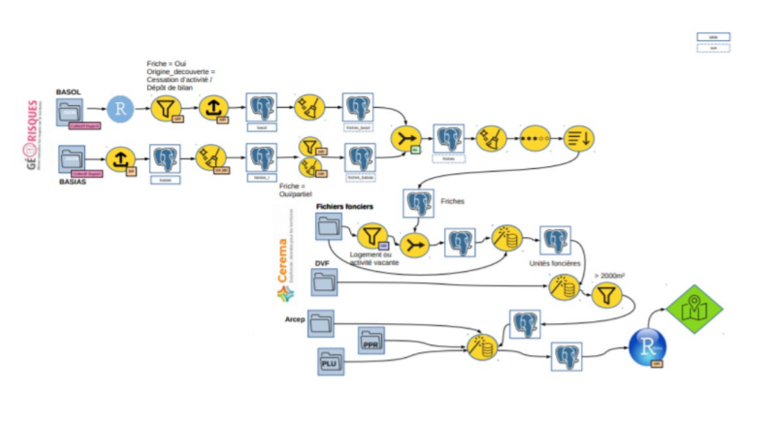
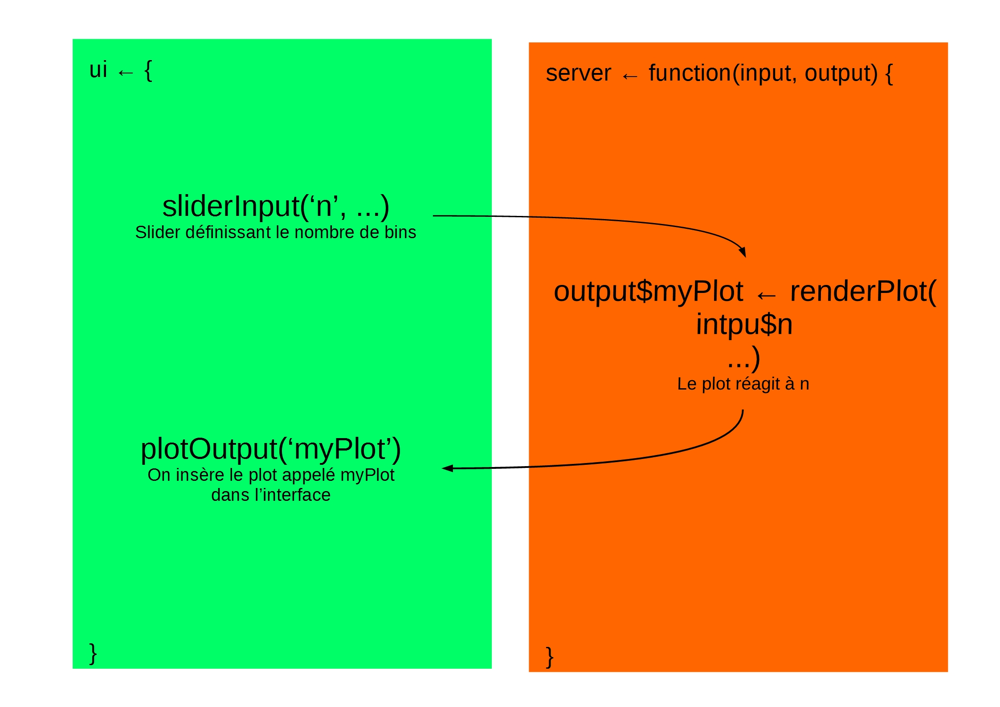
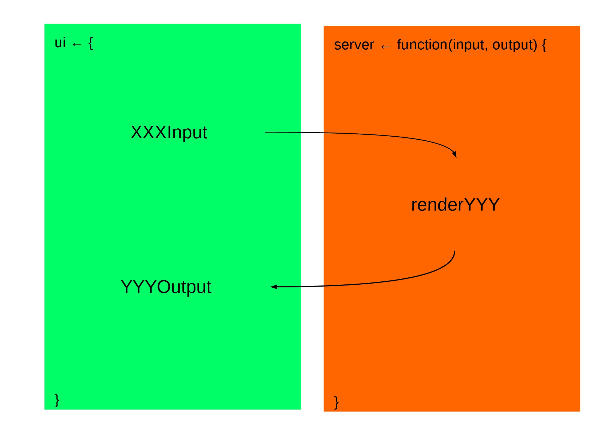
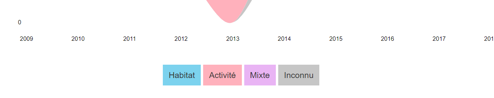
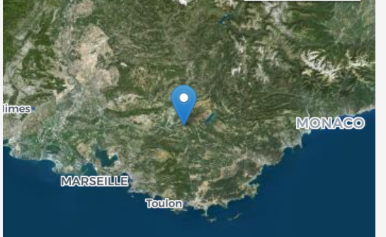
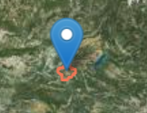
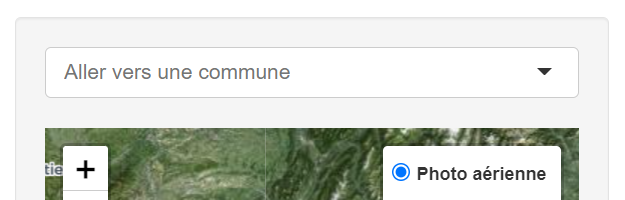
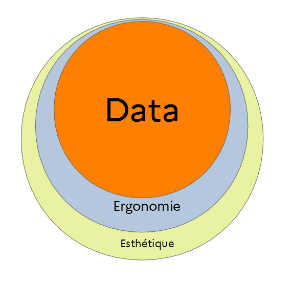

--- 
title: "Développement d'une application Shiny sur l'artificialisation"
author: "Mathieu Rajerison"
date: "`r Sys.Date()`"
site: bookdown::bookdown_site
documentclass: book
bibliography: [book.bib, packages.bib]
# url: your book url like https://bookdown.org/yihui/bookdown
# cover-image: path to the social sharing image like images/cover.jpg
description: |
  Développement pas à pas d'une application Shiny permettant de voir l'évolution de l'artificialisation en région Sud
link-citations: yes
github-repo: rstudio/bookdown-demo
---

# Introduction {-}


<font size="2">
*Crédit photographique Pascal Boulin*
</font>


## Le parcours de formation

Ce dispositif de formation vise à faire monter en compétence les agents du MTES (Ministère de la transition écologique et solidaire) et du MCT (Ministère de la cohésion des territoires) dans le domaine de la science de la donnée avec le logiciel R. Il est conçu pour être déployé à l'échelle nationale par le réseau des CVRH (Centre de Valorisation des Ressources Humaines).

Le parcours proposé est structuré en modules de 2 jours chacun. Les deux premiers (ou un niveau équivalent) sont des pré-requis pour suivre les suivants qui sont proposés "à la carte" :

1. Socle : Premier programme en R
2. Socle : Préparation des données
3. Statistiques descriptives
4. Analyses multivariées
5. Datavisualisation : Produire des graphiques, des cartes et des tableaux
6. Documents reproductibles avec RMarkdown (2^ème^ trimestre 2020)
7. Analyse spatiale 
8. Applications Shiny

La mise à disposition des supports de formation se fait désormais par la [page d'accueil du parcours de formation](https://mtes-mct.github.io/parcours-r/). Ces supports sont en [licence ouverte](https://www.etalab.gouv.fr/wp-content/uploads/2017/04/ETALAB-Licence-Ouverte-v2.0.pdf).

Si vous souhaitez accéder aux sources ou aux données mobilisées pendant les formations, il faut directement les télécharger depuis le [Github du ministère](https://github.com/MTES-MCT?q=parcours-r).

Pour vous tenir au courant de l'offre de formation proposée par le réseau des CVRH, [consultez la plateforme OUPS](http://oups-cmvrh.e2.rie.gouv.fr/) (un accès intranet MTES-MCT est nécessaire). Vous pouvez vous y abonner pour recevoir les annonces de formation qui vous intéressent.

Il existe une liste pour échanger de l'information, discuter autour de R ou encore faire part de difficultés pour trouver ensemble les solutions. Pour s'insrire, envoyer un message vide avec le titre "subscribe labo.communaute-r" à l'adresse sympa@developpement-durable.gouv.fr.

## Objectifs de ce module

L’objectif de ce module est de présenter le développement d'une application Shiny autour de l'artificialisation.

Dans un premier temps, nous préparerons les éléments nécessaires au développement de l'application Shiny et nous assurerons ainsi de la maîtrise des bases.

Par la suite, nous implémenterons les éléments préparés au sein d'une application Shiny.

Nous verrons dans cette dernière phase, la plus importante :

- L'architecture d'une application Shiny
- Différents éléments d'interface (UI ou User Interface)
- Différents modes d'interaction avec les données
- Différentes façons de visualiser la donnée

Les librairies suivantes seront nécessaires :
```{r setup, eval=T,echo=F,message=F,warning=F}
knitr::opts_chunk$set(cache = T, 
                      echo = T, 
                      comment = "",
                      message = F,
                      warning = F)

#Chargement des packages et des données.
library(tidyverse)
library(sf)
library(leaflet )
library(streamgraph)
library(ggplot2)
```

```{r include=FALSE}
# automatically create a bib database for R packages
knitr::write_bib(c(
  .packages(), 'bookdown', 'knitr','kableExtra', 'rmarkdown','sf','ggplot2','tmap'
), 'packages.bib')
```

<!--chapter:end:index.Rmd-->

# Quelques datavisualisations

## La carte du choléra de John Snow


[Voir](https://fr.wikipedia.org/wiki/%C3%89pid%C3%A9mie_de_chol%C3%A9ra_de_Broad_Street)

### Charles Joseph Minard


[Voir](https://fr.wikipedia.org/wiki/Charles_Joseph_Minard)

## La correspondance de Stefanie Posavec et Giorgia Lupi


<!-- addiction téléphone, mauvaise humeur, sorry --> 

[Dar data](http://www.dear-data.com/theproject)

## Le suivi de l'épidémie en ligne de Guillaume Rozier


[Covid-tracker](https://covidtracker.fr/)

## Le Data-Driven DJ de Brian Foo
<iframe title="vimeo-player" src="https://player.vimeo.com/video/118358642?h=8a59e78eff" width="640" height="360" frameborder="0" allowfullscreen></iframe>

[Voir](https://datadrivendj.com/tracks/subway)

## Quelques théories et théoriciens
### Jacques Bertin


## Leland Wilkinson


## Edward Tufte


## Des outils pour visualiser
### Outils bureau
- Tableau 
- ESRI Dashboards
- MViewer
- ...

### Python
- dash
- plotly
- matplotlib
- seaborn
- bokeh
- ...

### R
- Shiny
- ggplot
- Rgl
- ...

### Javascript
- leaflet
- D3 & ObservableHQ
- svelte
- kepler
- Charts.js
- ...

## Des dataviz Cerema faites sous Shiny
### trafic covid

[https://dataviz.cerema.fr/trafic-routier](https://dataviz.cerema.fr/trafic-routier)

### Cartofriches

[https://cartofriches.cerema.fr/](https://cartofriches.cerema.fr/)

!! Mettre appli ODD Sylvain Loze

<!--chapter:end:01-intro.Rmd-->

# Lecture des données de flux

Dans ces notebooks, nous nous intéresserons aux flux d'artificialisation vers différents postes : habitat, activité,... au fil des ans, sur la période 2009 à 2020. 

Ces différents notebooks visent à poser les bases d'une application Shiny d'exploration de ces données.

## Téléchargement de la donnée
Le fichier à télécharger s'appelle `obs_artif_conso_com_2009_2020_V2.csv` et se situe à l'adresse [https://cerema.app.box.com/v/pnb-action7-indicateurs-ff/folder/149684581362](https://cerema.app.box.com/v/pnb-action7-indicateurs-ff/folder/149684581362)

On le télécharge dans le dossier `data` de notre répertoire de travail.

## Chargement des librairies
Chargeons la fameuse librairie 'couteau suisse' `tidyverse`. Celle-ci contient des librairies essentielles telles que dplyr, magrittr (pour les pipes `%>%`),...
```{r message = FALSE, warning = FALSE}
library(tidyverse)
```

## Lecture de la donnée
Lisons nos données :
```{r}
flux <- read_csv("data/obs_artif_conso_com_2009_2020_V2.csv")
glimpse(flux)
```

## Contrôle
Un petit souci : certaines colonnes sont de type caractères, alors qu'elles devraient être de type numérique. C'est le cas de `surfcom20`, par exemple.

```{r}
class(flux$surfcom20)
```

Listons les colonnes de type caractères :
```{r}
sapply(names(flux), function(x) class(flux[[x]]) == "character") %>% which %>% {names(flux)[.]}
```
Les colonnes `artcom0920`, `artpop1217` et `surfcom20` devraient être de type numérique.

Recherchons les valeurs non numériques dans ces colonnes :
```{r}
w <- grep("^(-|[0-9]|\\.)*$", flux$artcom0920, perl = TRUE)
flux$artcom0920[-w] %>% unique

w <- grep("^(-|[0-9]|\\.)*$", flux$artpop1217, perl = TRUE)
flux$artpop1217[-w] %>% unique

w <- grep("^(-|[0-9]|\\.)*$", flux$surfcom20, perl = TRUE)
flux$surfcom20[-w] %>% unique
```

Il s'agit des valeurs 'NULL'.

Quels sont les départements pour lesquels on a cette valeur (et donc pour lesquels on n'a pas de surface) ?
```{r}
flux$iddep[-w]
```
Il s'agit des départemments d'Outre-Mer.

## Relecture du fichier
Nous pouvons relire le fichier en mentionnant cette 'NULL' comme étant NA

```{r}
flux <- read_csv("data/obs_artif_conso_com_2009_2020_V2.csv", na = c("", "NULL"))
glimpse(flux)
```

Nous voyons qu'il n'y a plus de valeurs 'NULL' :
```{r}
which(flux$surfcom20 == "NULL")
```

<!--chapter:end:02-prepa-read.Rmd-->

# Traitement de la donnée

Dans ce notebook, nous allons préparer la donnée, afin d'obtenir la donnée transformée escomptée, à savoir un flux d'artificialisation par commune et par année.

## Lecture des données
Lisons les données de flux
```{r message = FALSE, warning = FALSE}
library(tidyverse)

flux <- read_csv("data/obs_artif_conso_com_2009_2020_V2.csv")
```

## Sélection des colonnes
Nous nous intéressons aux flux entre années et allons sélectionner seulement les colonnes utiles, à savoir, les colonnes `art09mix10`, `art10mix11`, etc...
```{r}
myCols <-  names(flux)[grep("^art[0-9]{2}\\S+[0-9]{2}$", names(flux))]
myCols
```

## Transformation du format wide vers long
Nous utiliserons **ggplot2** pour représenter les données. Nous aurons besoin, avant d'utiliser les données, de passer d'un format wide (en largeur) à un format long (en longueur).

En effet, les noms de colonnes, comme `art19hab20` ou `art13mix14` portent en eux des attributs : type de flux, et année du flux, que nous aimerions bien voir apparaître dans les cellules de notre tableau.

Par exemple, pour `art19hab20`, l'année du flux est l'année 2019 et concerne les flux vers l'habitat. On pourrait imaginer avoir une colonne pour l'année du flux, et une colonne pour son type.

Pour `art13mix14`, le flux est concerne les flux d'artificialisation vers le mixte pour l'année 2013.

Voici la différence entre un fichier de type _wide_ et un fichier de type _long_ :

### Wide

| id | nom | sport | ville | 
| -- | -- | -- | -- |
| 1 | mathieu | squash | Aix-en-Provence |

### Long

| id | variable | valeur |
| -- | -- | -- |
| 1 | nom | mathieu |
| 1 | sport | squash |
| 1 | ville | Aix-en-Provence |

Dans notre cas, nous passerions de cette structure :
| idcom | art19hab20 |
| -- | -- |
| 13001 | 111096 |

à cette structure

| idcom | year | type | value | 
| -- | -- | -- | -- |
| 13001 | 2019 | habitat | 111096 |

### Transformation au format _long_ avec `gather`
Prenons l'exemple d'Aix en Provence. Les données sont dans un format wide (le plus commun, avec les variables en colonnes) :
```{r}
df <- flux %>% filter(idcom == "13001")
df[, c("idcom", "idcomtxt", myCols)]

```

Pour transformer au format long, nous utilisons la fonction `gather` :
```{r}
df <- df[, c("idcom", "idcomtxt", myCols)]
df <- gather(df,
             "variable", # key
             "value",    # value
             myCols) # variables
df
```

La colonne `variable` comporte des valeurs telles que `art09hab10` pour le flux d'artificialisation vers l'habitat de 2009 à 2010 :
```{r}
unique(df$variable)
```

## Année et destination du flux
Nous allons extraire l'année et le type (habitat, activité, mixte, inconnu) depuis le champ ` variable` :
```{r}
df$year <- gsub("art([0-9]{2})(\\S+)[0-9]{2}", "20\\1", df$variable)
df$type <- gsub("art([0-9]{2})(\\S+)[0-9]{2}", "\\2", df$variable)
```

Voici le résultat:
```{r}
df %>% head
```

## Retraitement
Améliorons le champ `type` pour avoir des libellés plus parlants :
```{r}
df <- df %>% mutate(type = case_when(
  type == "hab" ~ "Habitat",
  type == "act" ~ "Activité",
  type == "mix" ~ "Mixte",
  type == "inc" ~ "Inconnu",
))
```

Au final, nous n'avons plus besoin de la variable variable :
```{r}
df$variable <- NULL
```

Voici notre fichier df au final :
```{r}
df
```

## Fonction `getStatsFlux`
Créons une fonction qui retourne les flux pour une commune donnée à partir de son code INSEE :
```{r}
getStatsFlux <- function(flux, codeInsee) {
  
  # Filtre par commune
  df <- flux %>% filter(idcom == codeInsee) 
  
  # Colonnes intéressantes
  myCols <-  names(flux)[grep("^art[0-9]{2}\\S+[0-9]{2}$", names(flux))]
  df <- df[, c("idcom", "idcomtxt", myCols)]
  
  # Long format
  df <- df %>% gather("variable", # key
                      "value",    # value
                      myCols) # variables
  
  # Année et type
  df$year <- gsub("art([0-9]{2})(\\S+)[0-9]{2}", "20\\1", df$variable)
  df$type <- gsub("art([0-9]{2})(\\S+)[0-9]{2}", "\\2", df$variable)
  
  # Renomme les valeurs de type
  df <- df %>% mutate(type = case_when(
  type == "hab" ~ "Habitat",
  type == "act" ~ "Activité",
  type == "mix" ~ "Mixte",
  type == "inc" ~ "Inconnu"))
  
  # Réagence les colonnes
  df <- df[, c("idcom", "idcomtxt", "year", "type", "value")]
  
  return(df)
}

flux %>% getStatsFlux("13001")
```

Enregistrons cette fonction dans le fichier `helpers.R`

## Data Engineering
Pas mal d'étapes de préparation sont parfois nécessaires avant de créer des applications de dataviz.


Voici la chaîne de données, assez conséquente, pour Cartofriches :


<!--chapter:end:03-prepa-process.Rmd-->

# Palette de couleurs

Dans ce notebook, nous allons réaliser un graphique assez simple avec `ggplot`.

## Lecture des données avec transformation

Lisons les données de flux et rappelons la fonction `getStatsFlux` :
```{r warning = FALSE, message = FALSE}
library(tidyverse)

flux <- read_csv("data/obs_artif_conso_com_2009_2020_V2.csv")
```

Chargeons notre fichier `helpers.R` qui contient nos fonctions :
```{r warning = FALSE, message = FALSE}
source("helpers/helpers.R", encoding = "UTF-8")
```

Nous avons notre fonction `getStatsFlux` pour voir les flux par année, pour une commune donnée :
```{r}
df <- flux %>% getStatsFlux("13001")
```

## Premier graphique
Maintenant que nous parvenons à récupérer les stats bien formatées, nous pouvons tenter le graphique des flux d'artificialisation sur Aix en Provence :

```{r}
library(ggplot2)

p <- ggplot(data = df, 
       aes(x = year, 
           y = value,
           fill = type)) +
  geom_bar(stat = "identity")

p
```

C'est vraiment le graphique le plus basique que nous puissions réaliser.

## Quelques améliorations
Nous pouvons en changer quelques éléments, améliorer l'esthétique :

```{r}
# Ordre des types
df$type <- as.character(df$type)
df$type <- factor(df$type, levels = c("Habitat", "Activité", "Mixte", "Inconnu"))

# Plot
p <- ggplot(data = df, 
       aes(x = year, 
           y = value,
           fill = type)) +
  geom_bar(stat = "identity") +
  theme(
        axis.title.x = element_blank(), # pas de titre pour l'axe X
        axis.ticks.x = element_blank(), # pas de tirets pour l'axe X
        axis.text.x = element_text(vjust = 3), # repositionnement des années un peu plus en haut (vu qu'on enlève les tirets)
        axis.ticks.y = element_blank(), # pas de tirets sur l'axe Y
        axis.title.y = element_blank(), # pas de titre pour l'axe Y
        panel.border = element_blank(), # pas de bordure
        panel.grid.major.x = element_blank(), # pas de lignes verticales
        panel.grid.minor.x = element_blank(), # pas de "sous"-lignes verticales
        legend.position = "bottom", # légende en vas
        legend.title = element_blank(), # pas de titre pour la légende
        plot.title = element_text(face = "bold", size = 10, colour = "grey60"), # titre en gras et en gris
        legend.text = element_text(size = 8) # taille de texte pour la légende (plus petit)
        ) +
  ggtitle("Flux d'artificialisation par année en Ha") + 
  scale_y_continuous(expand = c(0, 0)) # réinitialise la marge en x et y vers les coordonnées 0,0 (au plus proche)
p
```

Nous avons allégé au maximum le graphique. Nous avons mis la légende en bas pour qu'elle n'écrase pas le graphique

Mais les couleurs ne sont pas forcément encore tops !..

## Couleurs HCL (Hue Chroma Luminance)
### A propos
Nous utilisons la modélisation de couleurs HCL (pour Hue Chroma Luminance).

En HCL, une couleur est définie selon trois paramètres :

- **Hue**, qui définit la teinte (bleue, rouge, ...) d'une couleur
- **Chroma** son côté coloré (colourfulness)
- **Luminance** sa luminosité

### Nos couleurs
Nous allons prendre 4 couleurs pour notre palette :

- <span style="color:blue;font-weight:700;">Bleue</span> pour l'habitat
- <span style="color:red;font-weight:700;">Rouge</span> pour l'activité (le rouge rappelle l'activité)
- <span style="color:darkmagenta;font-weight:700;">Magenta</span> pour mixte (un peu un mélange des deux premiers)
- <span style="color:grey;font-weight:700;">Gris</span> pour la catégorie Inconnu (gris est une couleur neutre qui symbolise bien l'inconnu)

Par défaut, le chroma sera fixé à 50, la luminosité à 80 (sur une échelle de 0 à 100) :
```{r warning = FALSE}
library(colorspace)

colorBlue    <- hcl(h = 220,
                    c = 50, 
                    l = 80, fixup = TRUE)

colorRed     <- hcl(h = 4, 
                    c = 50, 
                    l = 80, fixup = TRUE)

colorMagenta <- hcl(h = 300, 
                    c = 50, 
                    l = 80, fixup = TRUE)

colorGrey    <- hcl(h = 0, 
                    c = 0, 
                    l = 80, fixup = TRUE)

myPalette <- c("blue" = colorBlue,
               "red" = colorRed,
               "magenta" = colorMagenta,
               "grey" = colorGrey)
```

### Assistants
A savoir que la librairie colorspace intègre un assistant pour choisir les couleurs dans un espace HCL :
```{r eval = FALSE}
hclcolorpicker
```

Le site de Sciences Po MediaLab propose un assistant vraiment pas mal pour choisir les couleurs HCL. Ce dernier s'appelle ["I Want Hue"](https://medialab.github.io/iwanthue/)

Testons notre palette :
```{r}
demoplot(myPalette, "bar")
```

Voici une représentation des couleurs dans l'espace HCL :
```{r}
hclplot(myPalette)
```

### Utilisation dans notre graphique
Utilisons cette nouvelle palette de couleurs dans notre graphique :

```{r}
p +
  scale_fill_manual(
      name = "Flux\nd'artificialisation\n2009-2020",
      labels = c("Habitat", "Activité", "Mixte", "Inconnu"),
      values = as.character(myPalette)
    )
```

## Export de la palette
Exportons notre palette de couleurs pour la réutiliser plus tard :
```{r}
saveRDS(myPalette, "myPalette.rds")
```

## Une couleur plus "punchy"
Utilisons une couleur plus "punchy" pour le magenta en mettant un chrom de 100 :
```{r}
p + scale_fill_manual(
      name = "Flux\nd'artificialisation\n2009-2020",
      labels = c("Habitat", "Activité", "Mixte", "Inconnu"),
      values = c(colorBlue, 
                 colorRed, 
                 hcl(h = 300, c = 100, l = 80), # Magenta
                 colorGrey)
    )

```

## Couleurs Cerema
Nous aurions aussi pu choisir les couleurs de l'établissement.

Lisons la palette de couleurs Cerema :
```{r warning=FALSE, message=FALSE}
library(rjson)

paletteCerema <- fromJSON(file = "palettes/palette_cerema.json")
paletteCerema
```

Elle est constituée d'une couleur pour le texte, pour les couleurs principales, secondaires et complémentaires.

Choisissons pour les couleurs des flux d'habitat, d'activité et mixtes des couleurs secondaires de la palette Cerema. Pour les données inconnues, on prend la couleur grise d'avant :
```{r}
p + scale_fill_manual(
      name = "Flux\nd'artificialisation\n2009-2020",
      labels = c("Habitat", "Activité", "Mixte", "Inconnu"),
      values = c(paletteCerema$secondaire$bleu, 
                 paletteCerema$secondaire$orange, 
                 paletteCerema$secondaire$vert,
                 colorGrey)
    )

```

<!--chapter:end:04-prepa-ggplot.Rmd-->

# Streamgraph

Dans ce notebook, ous allons représenter la donnée à l'aide d'un _streamgraph_.

## Lecture des données
Chargeons les librairies, lisons nos données :
```{r message = FALSE, warning = FALSE}
library(tidyverse)

source("helpers/helpers.R", encoding = "UTF-8")

flux <- read_csv("data/obs_artif_conso_com_2009_2020_V2.csv")
```

Récupérons aussi notre palette de couleurs :
```{r message = FALSE, warning = FALSE}
myPalette <- readRDS("palettes/myPalette.rds")
```

## Installation de la librairie `streamgraph`
```{r, eval = FALSE}
devtools::install_github("hrbrmstr/streamgraph")
```

## Streamgraph
Récupérons les données de flux d'Aix-en-Provence :
```{r}
df <- flux %>% getStatsFlux("13001")
```

Réalisons le streamgraph sur Aix-en-Provence :
```{r warning=FALSE}
library(streamgraph)

# L'ordre des inverse dans les streamgraphs
df$type <- factor(df$type, levels = c("Inconnu", "Mixte", "Activité", "Habitat"))

# Plot
df %>%
  streamgraph("type", "value", "year", sort = FALSE) %>%
  sg_axis_x(1, "Année", "%Y") %>% 
  sg_fill_manual(rev(myPalette))

```

> `factor` permet de définir l'ordre d'affichage des entités. Et nous utilisons `rev(myPalette)` car `streamgraph` inverse la palette.

## Fonction `makeStream`
Nous pouvons créer une fonction qui retourne le streamgraph de n'importe quelle commune :
```{r}
makeStream <- function(flux, codeInsee) {
  
  df <- flux %>% getStatsFlux(codeInsee)
  
  # L'ordre des inverse dans les streamgraphs
  df$type <- factor(df$type, levels = c("Inconnu", "Mixte", "Activité", "Habitat"))
  
  # Plot
  df %>%
    streamgraph("type", "value", "year", sort = FALSE) %>%
    sg_axis_x(1, "Année", "%Y") %>% 
    sg_fill_manual(rev(myPalette))
}
```

Voici une utilisation de la fonction `makeStream` sur Marseille :
```{r}
flux %>% makeStream("13055")
```

Ou sur Toulon :
```{r}
flux %>% makeStream("83137")
```

Cette fonction nous sera bien utile dans l'application Shiny.

## Dimensions d'une dataviz
Voici selon moi les dimensions d'une dataviz :


<!--chapter:end:05-prepa-stream.Rmd-->

# Spatial

Dans ce notebook, nous allons voir comment intégrer la dimension spatiale (requêtes spatiales), en préparation de la dimension cartographique de l'application Shiny.

## Librairie sf
Chargeons `tidyverse`, et la librairie `sf`
```{r message = FALSE, warning = FALSE}
library(tidyverse)
library(sf)
```

## Contours administratifs
Lisons nos données administratives [AdminExpress](https://geoservices.ign.fr/adminexpress#telechargement) en les reprojetant du Lambert 93 (EPSG:2154) vers le WGS84 (EPSG:4326) :
```{r eval=FALSE}
comms <- st_read("data/COMMUNE_CARTO/COMMUNE_CARTO.shp") %>% 
  st_set_crs(2154) %>% 
  st_transform(4326)
```

## Export
Exportons les données sur la Région Sud pour un usage ultérieur, dans l'application Shiny par exemple :
```{r eval=FALSE}
saveRDS(comms %>% filter(INSEE_REG == 93), "comms.rds")
```

```{r inlude=FALSE}
comms <- readRDS("data/comms.rds")
```


## Coordonnées au clic
Lorsqu'on cliquera sur la carte dans l'appli Shiny, les coordonnées seront retournées à l'utilisateur sous cette forme :
```
$lat
[1] 43.2829

$lng
[1] 6.2507

$.nonce
[1] 0.8278805

```

## Point
On crée un point depuis les coordonnées comme ceci :
```{r}
pt <- c(6.2507, 43.2829) %>% st_point %>% st_sfc %>% st_set_crs(4326)
```

## Commune localisée au clic
On intersecte les communes avec le point :
```{r}
i <- st_intersects(comms, pt)
```

On détermine la commune localisée au point :
```{r}
w <- which(sapply(i, function(x) length(x) != 0))
codeInsee <- comms$INSEE_COM[w]
```

## Fonction `getCommCenter`
On peut en faire une fonction `getCommCenter` :
```{r}
getCommCenter <- function(comms, coords) {
    pt <- coords %>% st_point %>% st_sfc %>% st_set_crs(4326)
    i <- st_intersects(comms, pt)
    w <- which(sapply(i, function(x) length(x) != 0))
    codeInsee <- comms$INSEE_COM[w]
    return(codeInsee)
}
```

Utilisons par exemple la fonction pour trouver la commune qui se situe au point de coordonnées `5.398602, 43.53609` :
```{r}
comms %>% getCommCenter(c(5.398602, 43.53609))
```

<!--chapter:end:06-prepa-spatial.Rmd-->

# Appli Shiny

Cette animation montre l'évolution de l'application depuis le premier commit jusqu'au dernier.

Nous partons d'une représentation assez basique (poser les bases) vers l'ajout progressif d'éléments d'interaction utilisateur, de représentation de la données, ainsi que d'éléments contextuels textes.

Cette animation montre l'évolution de l'appli depuis le premier commit jusqu'au dernier :


Le code de l'application est accessible dans le répertoire github [shiny-artif-app](https://github.com/datagistips/shiny-artif0920-app).

## Préambule
### Template de base
Pour créer une application Shiny, il faut, depuis [RStudio](https://www.rstudio.com/products/rstudio/download/), aller dans `File > New File > Shiny Web App...`


Cela crée une application basique qui sert d'exemple, avec une liste déroulante et un graphique d'exemple :


```{r eval = FALSE }
library(shiny)

ui <- fluidPage(

    ## Application title
    titlePanel("Old Faithful Geyser Data"), ## on changera le nom de l'appli plus tard

    sidebarLayout(
        sidebarPanel(
            "liste"
        ),
        mainPanel(
          "résultats"
        )
    )
)

server <- function(input, output) {
  ## vide pour le moment
}

## Run the application 
shinyApp(ui = ui, server = server)
```
- `ui` est la partie destinée à accueillir les éléments d'interface (esthétique)
- `server` est la partie dans laquelle seront définis les mécanismes d'interaction, d'interrogation et de représentation des données. La partie `server` réagit aux contrôles (slider, boutons, ...) définis dans `ui`


Dans l'exemple d'application de base proposée par RStudio, le plot réagit au nombre de bins (barres) défini par un slider. Ainsi, on a cette interaction :



> En quelque sorte, par analogie avec un modèle MVC (Modèle Vue Contrôleur), `ui` concerne la Vue et `server` le Contrôleur.

Dans tous les cas, on a cette modélisation pour les contrôles, sorties dans Shiny :



- un `renderStreamgraph` pourra réagir à un input de `ui`, et sera rendu dans `ui` sous la forme de `streamgraphOutput`
- un `renderText` aura son pendant `textOutput` 
- etc...

Ce sont les mêmes conventions qui sont utilisées.

On a des `inputs`, des fonctions `render`, et des `outputs`

► [Voir cette version](https://github.com/datagistips/shiny-artif-app/commit/006bc70d801a290ef1771b69cd2ded14e0b12516) (006bc70d801a290ef1771b69cd2ded14e0b12516)

### Poser les bases 

Dans un premier temps, on pose les bases, et on efface certains éléments de l'application d'exemple.

► [Voir cette version](https://github.com/datagistips/shiny-artif-app/commit/414c6942ce44edd411e256ab0295bb50de2fa059) (414c6942ce44edd411e256ab0295bb50de2fa059)

`server.R`
La partie est laissée vide pour le moment :
```{r eval = FALSE}
server <- function(input, output) {
## vide
}
```

### Lecture des données et liste déroulante des communes


On lit les données de flux :
```{r eval = FALSE}
flux <- read_csv("data/obs_artif_conso_com_2009_2020_V2.csv", na = c("", "NULL")) %>% 
    filter(idreg == "93")
```

Ainsi que les données communales :
```{r eval = FALSE}
## Contours de communes
comms <<- readRDS("data/comms.rds") %>% 
    filter(INSEE_REG == 93)

## Liste communes
communes <- flux$idcom
names(communes) <- glue("{flux$idcomtxt} ({flux$idcom})")
```
`ui.R`
On ajoute la liste déroulante des communes maintenant qu'elles ont été lues :
```{r eval = FALSE}
    sidebarLayout(
        sidebarPanel(
            selectInput("communes", label = NULL, choices = communes, selected = NULL),
        ),

        mainPanel(
           "Résultats"
        )
    )

```
► [Voir cette version](https://github.com/datagistips/shiny-artif-app/commit/9c271b706e34afff002b6e6d5df7ef895af1907e) (9c271b706e34afff002b6e6d5df7ef895af1907e)

###  Affiche un tableau des résultats


On peut afficher un tableau des résultats de flux pour une commune sélectionnée, juste pour tester les mécanismes de sélection, notamment la fonction `getStatsFlux` vue dans un précédent notebook.

`ui.R`
```{r eval = FALSE}
mainPanel(
          dataTableOutput("tbResults")
        )
```

`server.R`
On ajoute les résultats avec `renderDataTable` et `dataTableOutput` :
```{r eval = FALSE}
    output$tbResults <- renderDataTable({
        codeInsee <- input$communes
        df <- flux %>% getStatsFlux(codeInsee)
        return(df)
    })
```
► [Voir cette version](https://github.com/datagistips/shiny-artif-app/commit/64c7a25268157cf832c9b57dc71b7dfffd663d9e) (64c7a25268157cf832c9b57dc71b7dfffd663d9e)

## Dataviz
### Ajoute le stream


On ajoute le streamgraph.

`ui.R`
```{r eval = FALSE}
mainPanel(
            streamgraphOutput("streamPlot")
        )
```

`server.R`
```{r eval = FALSE}
    output$streamPlot <- renderStreamgraph({
        myStream <- flux %>% makeStream(codeInsee)
        return(myStream)
    })
```
► [Voir cette version](https://github.com/datagistips/shiny-artif-app/commit/a402e8385afcf0c350ac0841037a69383e85eace) (a402e8385afcf0c350ac0841037a69383e85eace)

## Contexte
### Ajoute les infos communales


On peut ajouter des informations assez sommaires sur la commune sélectionnée, sous la forme de texte.

`ui.R`
```{r eval = FALSE}
mainPanel(
    textOutput("txtCommune"),
    streamgraphOutput("streamPlot")
)
```

`server.R`
```{r eval = FALSE}
output$txtCommune <- renderText({
    codeInsee <- input$communes
    fComm <- flux %>% filter(idcom == codeInsee)

    paste(fComm$idcomtxt, fComm$idcom, fComm$artcom0920)
})
```
► [Voir cette version](https://github.com/datagistips/shiny-artif-app/commit/602a3ea312be829aca7146e5563c001cdd33e823) (602a3ea312be829aca7146e5563c001cdd33e823)

### Ajoute la légende


`server.R`
Pour la légende, on utilise simplement de l'HTML stylisé, plutôt que la légende du plot.

```{r eval = FALSE}
tagList(
            div(
                myStream,
                style="margin-bottom:20px;"
            ),
            div(
                tags$span("Habitat",
                          style = glue("background-color:{myPalette['blue']};padding:10px;")),
                tags$span("Activité",
                          style = glue("background-color:{myPalette['red']};padding:10px;")),
                tags$span("Mixte",
                          style = glue("background-color:{myPalette['magenta']};padding:10px;")),
                tags$span("Inconnu",
                          style = glue("background-color:{myPalette['grey']};padding:10px;")),
                style="text-align:center"
            )
        )
```
On peut faire du HTML assez avancé avec R Shiny !

► [Voir cette version](https://github.com/datagistips/shiny-artif-app/commit/9c2ab647d7d7376fa84ee19b3239822260933d77) (9c2ab647d7d7376fa84ee19b3239822260933d77)

## Charte
### Titre avec couleurs cerema


Ici, on intègre un élément de charte graphique Cerema, notamment la palette graphique de l'établissement au format JSON.

► [Voir cette version](https://github.com/datagistips/shiny-artif-app/commit/c1868418f645a374a8bfda9a3fb11bc0d72a18ec) (c1868418f645a374a8bfda9a3fb11bc0d72a18ec)

## Contexte
###  Ajoute la surface artificialisée totale
On ajoute une nouvelle information en texte.

► [Voir cette version](https://github.com/datagistips/shiny-artif-app/commit/9c6f9bed953ea15b948fa371a1d988df5acd27ee) (9c6f9bed953ea15b948fa371a1d988df5acd27ee)

## `reactive`
###  Ajout de reactive `fComm`
Les variables de type `reactive` sont très utiles lorsqu'il s'agit de récupérer à plusieurs endroits le résultat d'une variable calculée car cela évite, entre autres, de devoir répliquer les mécanismes de création de cette variable à ces multiples endroits. Aussi, un mécanisme interne permet de ne pas recalculer la variable si elle n'a pas changé avec les nouveaux critères de création.

`server.R`
```{r eval = FALSE}
fComm <- reactive({
    fComm <- flux %>% filter(idcom == input$communes)
    return(fComm)
})
```

On peut récupérer les variables comme ceci :
```{r eval = FALSE}
fComm()$artcom0920
fComm()$nafart0920
```

► [Voir cette version](https://github.com/datagistips/shiny-artif-app/commit/739307b7430ab0d52f3c241fd16d4404c80c927b) (739307b7430ab0d52f3c241fd16d4404c80c927b)

## Carto
###  Ajoute la carte leaflet


`ui.R`
```{r eval = FALSE}
leafletOutput("mymap")
```

`server.R`
```{r eval = FALSE}
output$mymap <- renderLeaflet({
        leaflet() %>%
            addTiles(group = "OSM")
})
```
► [Voir cette version](https://github.com/datagistips/shiny-artif-app/commit/5e5be7cf03e9ad4d145c292477d958af00f76904) (5e5be7cf03e9ad4d145c292477d958af00f76904)

###  Centre la carte sur PACA


`server.R`
Pour ajuster la carte sur PACA, on utile la fonction `fitBounds`.

```{r eval = FALSE}
output$mymap <- renderLeaflet({

        bb <- st_bbox(comms) %>% as.numeric

        leaflet() %>%
            addTiles(group = "OSM") %>%
            fitBounds(lng1 = bb[1], 
                      lat1 = bb[2], 
                      lng2 = bb[3], 
                      lat2 = bb[4])
    })
```
► [Voir cette version](https://github.com/datagistips/shiny-artif-app/commit/593b2972d14ee8f0f044fb43b2abc41932c4b1ab) (593b2972d14ee8f0f044fb43b2abc41932c4b1ab)

### Ajoute les fonds de carte


Ajoutons davantage de fonds cartos, notamment ceux de l'IGN : orthophoto, Plan IGN.

`server.R`
```{r eval = FALSE}
output$mymap <- renderLeaflet({

    leaflet() %>%
            addTiles(group = "OSM") %>%
            addProviderTiles(providers$CartoDB.PositronOnlyLabels, group = "Villes") %>% 
            addTiles("http://wxs.ign.fr/choisirgeoportail/wmts?REQUEST=GetTile&SERVICE=WMTS&VERSION=1.0.0&STYLE=normal&TILEMATRIXSET=PM&FORMAT=image/png&LAYER=GEOGRAPHICALGRIDSYSTEMS.PLANIGNV2&TILEMATRIX={z}&TILEROW={y}&TILECOL={x}",
                     options = c(WMSTileOptions(tileSize = 256),
                                 providerTileOptions(minZoom = 1, maxZoom = 15)),
                     attribution='<a target="_blank" href="https://www.geoportail.gouv.fr/">Geoportail France</a>',
                     group = "Plan IGN"
            ) %>%
            addTiles("http://wxs.ign.fr/choisirgeoportail/wmts?REQUEST=GetTile&SERVICE=WMTS&VERSION=1.0.0&STYLE=normal&TILEMATRIXSET=PM&FORMAT=image/jpeg&LAYER=ORTHOIMAGERY.ORTHOPHOTOS&TILEMATRIX={z}&TILEROW={y}&TILECOL={x}",
                     options = c(WMSTileOptions(tileSize = 256),
                                 providerTileOptions(minZoom = 1, maxZoom = 22)),
                     attribution='<a target="_blank" href="https://www.geoportail.gouv.fr/">Geoportail France</a>',
                     group = "Photo aérienne"
            ) %>%
            addLayersControl(baseGroups    = c("Photo aérienne", "Plan IGN", "OSM"),
                             overlayGroups = "Villes",
                             options       = layersControlOptions(collapsed = FALSE)) %>%
            fitBounds(lng1 = bb[1], lat1 = bb[2], lng2 = bb[3], lat2 = bb[4])
})
```
► [Voir cette version](https://github.com/datagistips/shiny-artif-app/commit/fb67dcc4b87bc13a8cb81847be5c4d5aee1e2b95) (fb67dcc4b87bc13a8cb81847be5c4d5aee1e2b95)

###  Coordonnées au clic


Pour trouver les coordonnées au clic, on utile un mécanisme de sélection basé sur input, notamment input$mymap.

> A noter que l'on peut aussi réagir au clic sur une entité (`input$mymap_shape_click`), voire au passage (`input$mymap_shape_mouseover`). [Voir à ce titre la page dédiée sur R Leaflet](https://rstudio.github.io/leaflet/shiny.html#inputsevents).

`ui.R`
```{r eval = FALSE}
verbatimTextOutput("foo")
```

`server.R`
```{r eval = FALSE}
output$foo <- renderPrint({
    input$mymap_click
})
```
► [Voir cette version](https://github.com/datagistips/shiny-artif-app/commit/a9fd41bd65be309d9a5c9e37835bad164ee9b37c) (a9fd41bd65be309d9a5c9e37835bad164ee9b37c)

## `reactive`
###  Rend codeInsee reactive
Le code INSEE est récupéré dynamiquement après un clic sur la carte.

On rend le code INSEE reactive car il sera utilisé à plusieurs endroits : [ici](https://github.com/datagistips/shiny-artif-app/commit/1edc95aebfe35df74ca77370b78dc1d0402157a6#diff-ee89f65a0b4e0dccabce1672d6d689b4e2b6ca51ea1e746bdda1eca94aaa6e0fR252) ou encore [là](https://github.com/datagistips/shiny-artif-app/commit/1edc95aebfe35df74ca77370b78dc1d0402157a6#diff-ee89f65a0b4e0dccabce1672d6d689b4e2b6ca51ea1e746bdda1eca94aaa6e0fR276)

► [Voir cette version](https://github.com/datagistips/shiny-artif-app/commit/4ac477bd273eaf5db7b0511764c9555182ef423e) (4ac477bd273eaf5db7b0511764c9555182ef423e)

### Ajoute le reactive
On peut créer des reactive en cascade, comme ici, pour `fComm()` qui s'appuie sur `codeInsee()`

`server.R`
```{r eval = FALSE}
fComm <- reactive({
        fComm <- flux %>% filter(idcom == input$communes)
        fComm <- flux %>% filter(idcom == codeInsee())
        return(fComm)
    })
```

Pour le streamgraph, on utilise `codeInsee()` comme ceci :
```{r eval = FALSE}
myStream <- flux %>% makeStream(codeInsee())
```
► [Voir la ligne de code](https://github.com/datagistips/shiny-artif-app/commit/f3d3ffb842c07aaa67a9e4c48b922e8b4fa858dc#diff-ee89f65a0b4e0dccabce1672d6d689b4e2b6ca51ea1e746bdda1eca94aaa6e0fR174)

► [Voir cette version](https://github.com/datagistips/shiny-artif-app/commit/f3d3ffb842c07aaa67a9e4c48b922e8b4fa858dc) (f3d3ffb842c07aaa67a9e4c48b922e8b4fa858dc)

## Refactoring
###  Fix : ajoute req
Quand les données ne sont pas encore chargées, on peut avoir un rendu bizarre avec un message d'erreur.


Du coup, on introduit la fonction `req` (pour 'requiert') qui exécute la suite seulement si la condition est réalisée :
```{r eval = FALSE}
fComm <- reactive({
    req(codeInsee()) ## < ici

    fComm <- flux %>% filter(idcom == codeInsee())
    return(fComm)
})
```
► [Voir cette version](https://github.com/datagistips/shiny-artif-app/commit/115ac4ea9c236d74fcbfd1cb2d48d3ae6309b063) (115ac4ea9c236d74fcbfd1cb2d48d3ae6309b063)

## Carto
###  Ajoute un marqueur


On crée un proxy à la carte pour réaliser plus tard des actions sur celle-ci (zoomer, ajouter des éléments cartos) sans avoir à recalculer la carte (appelée mymap) à chaque fois :
```{r eval = FALSE}
proxy <- leafletProxy("mymap")
```

On ajoute le centroïde de la commune cliquée :
```{r eval = FALSE}
observe({
    req(codeInsee())
    myComm <- comms %>% filter(INSEE_COM == codeInsee())

    ## Ajout du marqueur
    proxy %>% 
        clearMarkers() %>% 
        addMarkers(data = myComm %>% st_centroid)
})
```
► [Voir cette version](https://github.com/datagistips/shiny-artif-app/commit/5821ff9c63199ec0bae647a5874f2080bb9d3d5a) (5821ff9c63199ec0bae647a5874f2080bb9d3d5a)

###  Ajoute le contour de la commune


On ajoute le contour de la commune (c'est plus sympa) :
```{r eval = FALSE}
proxy %>% 
    clearShapes() %>% 
    addPolygons(data = myComm,
                color = paletteCerema$secondaire$orange, 
                weight = 1, 
                smoothFactor = 0.5,
                opacity = 1, 
                fillOpacity = 0.3,
                fillColor = paletteCerema$secondaire$orange,
                highlightOptions = highlightOptions(color = paletteCerema$secondaire$orange, 
                                                    weight = 2,
                                                    fillOpacity = 0.1,
                                                    bringToFront = TRUE))
```
► [Voir cette version](https://github.com/datagistips/shiny-artif-app/commit/9b4455e5213c849edcdad0a9d2f905f377f2f84a) (9b4455e5213c849edcdad0a9d2f905f377f2f84a)

### Va vers la commune


Le marqueur s'affiche, le contour aussi, mais parfois la commune semble loin, lo i n, l o    i   n

Du coup, petite astuce ergonomique : au clic, on va automatiquement vers la commune cliquée :
```{r eval = FALSE}
bb <- st_bbox(myComm)
proxy %>%
    flyToBounds(lng1 = as.numeric(bb$xmin),
                lat1 = as.numeric(bb$ymin),
                lng2 = as.numeric(bb$xmax),
                lat2 = as.numeric(bb$ymax))
```
► [Voir cette version](https://github.com/datagistips/shiny-artif-app/commit/404f64ab1fbd9fe00dd9da0634faf407007278b5) (404f64ab1fbd9fe00dd9da0634faf407007278b5)

###  La liste déroulante permet d'aller vers une commune


On peut même changer le comportement de la liste déroulante utilisée au début pour afficher les stats ([voir cette ligne](https://github.com/datagistips/shiny-artif-app/commit/64c7a25268157cf832c9b57dc71b7dfffd663d9e#diff-ee89f65a0b4e0dccabce1672d6d689b4e2b6ca51ea1e746bdda1eca94aaa6e0fR73)) pour aller automatiquement vers la commune cliquée :
```{r eval = FALSE}
observeEvent(input$communes, {
    codeInsee <- input$communes
    bb <- comms %>% filter(INSEE_COM == codeInsee) %>% st_bbox %>% as.numeric
    proxy %>% flyToBounds(lng1 = bb[1], lat1 = bb[2], lng2 = bb[3], lat2 = bb[4])
})
```

C'est aussi l'occasion d'introduire `observeEvent` qui 'écoute' les évènements, et qui, ici déclenche une action lorsqu'on choisit un élément dans la liste des communes (`input$communes`)

► [Voir cette version](https://github.com/datagistips/shiny-artif-app/commit/d295c184cd8801dfdcc4befb414d98ea8c0d4ea9) (d295c184cd8801dfdcc4befb414d98ea8c0d4ea9)

###  Ajoute l'élément vide à la liste des communes


Généralement, le premier élément d'une liste est une instruction type 'Veuillez choisir une commune'

► [Voir cette version](https://github.com/datagistips/shiny-artif-app/commit/4e5c6628148bb98841d8468d10dea8a69b2e5c6d) (4e5c6628148bb98841d8468d10dea8a69b2e5c6d)

## Refactoring
###  Précise qu'il faut cliquer sur la carte pour afficher les stats


Au lieu d'utiliser `req` ([voir ce commit](https://github.com/datagistips/shiny-artif-app/commit/115ac4ea9c236d74fcbfd1cb2d48d3ae6309b063)) qui conditionne l'affichage à la sélection d'une commune, nous pouvons générer un message pour préciser qu'il faut cliquer sur la carte lorsqu'aucune commune n'a été cliquée.

Si aucune commune n'est sélectionnée : valeur nulle, alors on affiche ce message ([Voir la ligne de code](https://github.com/datagistips/shiny-artif-app/commit/56fd55bfa4cc066af658f7c779398c95c8276275?diff=split#diff-ee89f65a0b4e0dccabce1672d6d689b4e2b6ca51ea1e746bdda1eca94aaa6e0fR202-R203))
:
```{r eval = FALSE}
if(is.null(codeInsee())) return(tagList(icon("mouse-pointer"), "Cliquez sur la carte pour afficher les statistiques"))
```

► [Voir cette version](https://github.com/datagistips/shiny-artif-app/commit/56fd55bfa4cc066af658f7c779398c95c8276275) (56fd55bfa4cc066af658f7c779398c95c8276275)

## Dataviz
### Ajoute la treemap et supprime la légende


Tiens, comme on y est, pourquoi pas ajouter une treemap.

`ui.R`
```{r eval = FALSE}
plotlyOutput("treemap")
```

`server.R`
```{r eval = FALSE}
output$treemap <- renderPlotly({
    req(codeInsee())
    flux %>% makeTreemap(codeInsee())  
})
```
► [Voir cette version](https://github.com/datagistips/shiny-artif-app/commit/1edc95aebfe35df74ca77370b78dc1d0402157a6) (1edc95aebfe35df74ca77370b78dc1d0402157a6)

## Refactoring
### Sépare en `ui.R`, `server.R` et `global.R`
Lorsque le code d'une application devient conséquent, cela peut être utile, plutôt que d'utiliser un unique fichier `app.R`, de séparer le contenu dans trois fichiers : `ui.R`, `server.R` et `global.R`

- `ui.R` comprend les éléments d'interface auparavant contenus dans `ui <- fluidPage({...})`
- `server.R` comprend la logique applicative et fonctionnelle de l'application : mécanismes d'interrogation et de représentation des données, auparavant contenue dans `server <- function(input, output) {...}`
- `global.R` comprend les variables utilisées dans l'application.

### Au sujet de `global.R`
Les variables contenues dans `global.R` deviennent automatiquement globales.

Il n'y a alors plus besoin d'utiliser la double flèche d'assignation des variables globales dans `global.R`

`server.R`
Précédemment, on avait ceci dans `server.R` :
```r
`monNom <<- "Mathieu"
```

### `global.R`
Dans `global.R`, la variable devient automatiquement globale même avec une assignation simple :
```r
`monNom <- "Mathieu"`
```

► [Voir cette version](https://github.com/datagistips/shiny-artif-app/commit/81991cf6ba1a4abef9df951bcdcc1858d97b6815) (81991cf6ba1a4abef9df951bcdcc1858d97b6815)

### Ajoute un fichier `helpers.R`
On peut créer un fichier annexe appelé `helpers.R` (nous aurions également pu l'appeler functions.R) dans lequel stocker les différentes stockées utilisées auparavant dans `server.R`

Cela a le mérite de rendre le code du fichier `server.R` plus _léger_, plus _lisible_ car mettant en évidence les mécanismes de façon macro plutôt que micro avec le détail de leur fonctionnement interne.

Nous faisons appel au fichier `helpers.R` au sein de `global.R`

### `global.R`
```r
source("helpers.R", encoding = "UTF-8")
```

► [Voir cette version](https://github.com/datagistips/shiny-artif-app/commit/b6a508c9db407cdc98969b50b80867554978796c) (b6a508c9db407cdc98969b50b80867554978796c)

## Contexte
On ajoute un fichier [`footer.md`](https://github.com/datagistips/shiny-artif0920-app/blob/master/footer.md) qui explique d'où vient l'application, donne les sources. 

On l'intègre avec la fonction `includeMarkdown`

```{r eval = FALSE}
tags$div(
    includeMarkdown("footer.md"), 
    style="font-size:0.8em")
```

► [Voir cette version](https://github.com/datagistips/shiny-artif0920-app/commit/d52adde3e3c68bd6e647443e5190630f75f5f9c9#diff-65704ad9823485af15425c156225c6a1aa8551dfcbb918cbb3781a4372684d62)

<!--chapter:end:07-shiny.Rmd-->

# Réflexions

## Data centric


Comme nous venons de le voir, le développement de l'application Shiny se concentre avant sur la donnée, si bien qu'une application Shiny peut tout à fait être développée sans connaissance du HTML, ou du CSS (bien que leur connaissance soit un pré-requis pour l'esthétisation du site).

Le contenu, à savoir la donnée, occupe une place centrale, et le développement du contenant, son habillage peuvent être opérés a posteriori.

Le développement peut être réalisé par un statisticien. Un ergonome peut ensuite définir le UX Design, à savoir le design de l'interface et de ses interactions. Enfin, un graphiste peut venir habiller le site d'une certaine charte graphique.

## Les étapes de développement d'une dataviz
Comme nous l'avons vu dans les notebooks 1 à 7, beaucoup de préparation est nécessaire avant d'aboutir à l'application : préparation des données, voire aussi préparation des mécanismes (fonctions) d'interrogation des données ou de représentation de celles-ci.

Le développement de cette dataviz a suivi ces différentes étapes :


### Collecte
Bien sûr, on ne peut pas représenter des choses qui n'existent pas, d'où l'importance de la collecte, et de la stabilité du point d'accès à la donnée, notamment lorsque votre dataviz doit être mise à jour régulièrement.

### Qualité

Une dataviz faite sur des données posant des soucis de qualité produira des graphiques de mauvaise qualité.

### Sémiologie
Une certaine sémiologie graphique et rigueur doit être suivie afin de restituer de manière convenable l'information à l'utilisateur.

### Expérience utilisateur
L'expérience utilisateur doit être prise en compte lors du développement, que ce soit dans la manipulation de l'interface ou la lecture des graphiques.

### Fonctionnalité
Rendre fonctionnel et généralisable les mécanismes sous la forme de fonctions permet déjà de rendre le code plus parlant, plus léger à la lecture, plus pérenne et appropriable par une tierce personne, mais aussi de les utiliser ailleurs, dans d'autres applis.

### Esthétique
Pas mal de temps peut être passé dans l'esthétique. Le respect d'une charte graphique, l'esthétisation est souvent le premier désir de celui qui vous demandera une application de dataviz.

### Refactoring
Enfin, le refactoring vise à améliorer les commentaires dans le code, réorganiser certaines fonctions, certains blocs de code pour faciliter la lecture et la pérénnité du code informatique, son appropriation par d'autres, ou par vous-même (lorsque le vent vous aura mené entre temps vers de multiples applis et que vous l'aurez un peu oubliée !)

## Dimensions d'une dataviz
Voici selon moi les dimensions d'une dataviz :


Dans les cas 1 et 2, l'information est intéressante, de valeur.

1. Dans le premier cas (cas 1), oin s'attache davantage à l'accessibilité de la dataviz, le fait qu'elle puisse être lue et interprétée facilement, alors que le second cas est celui d'une dataviz sophistiquée dans sa manière de rendre, et sans doute créative, mais qui ne mise pas vraiment sur l'accessibilité de la représentation.

2. Le second cas est souvent privilégié par ceux qui s'intéressent aux représentations abstraites et artistiques réalisées avec de la donnée, à savoir celles réalisées par des data artists, comme on serait tentés de les appeler.

La première stratégie est sans doute celle à adopter par d'institutions publiques, car privilégiant la transmission et l'intelligibilité des informations à diffuser.

<!--chapter:end:08-réflexions.Rmd-->

